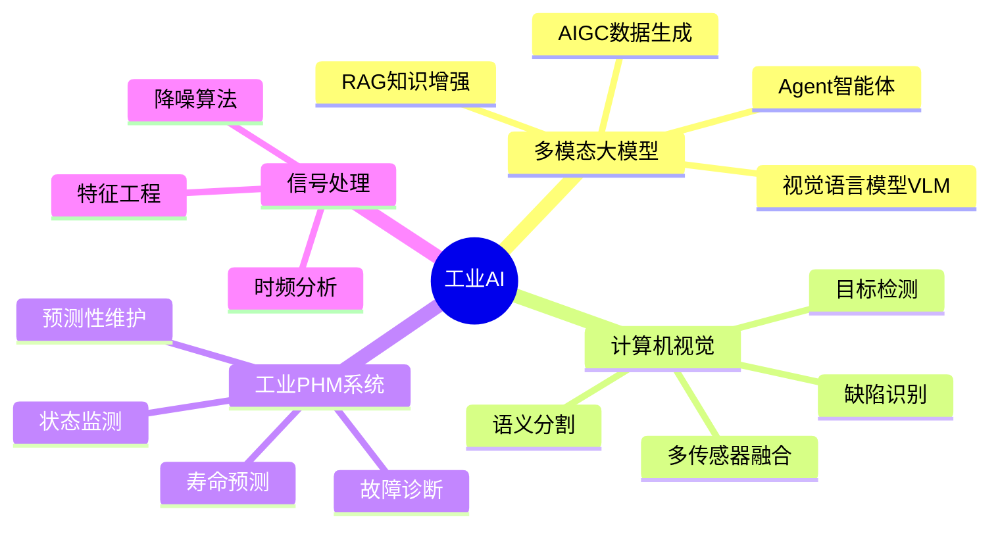

# 👋 Hi, I'm [Your Name]

<div align="center">

**算法工程师 | 工业AI研究者 | 多模态大模型探索者**

[](https://github.com/yourusername)
[](https://github.com/yourusername)

*"将前沿学术研究转化为可落地的工业解决方案"*

</div>

---

## 🎯 研究方向



**核心关键词**：`多模态大模型` `RAG` `工业视觉` `PHM系统` `传感器融合` `AIGC` `边缘计算`

---

## 🔥 最新进展 (2025)

<table>
<tr>
<td width="50%">

### 🧠 多模态诊断Agent
基于 **Qwen-VL + RAG** 构建工业设备智能诊断系统
- 视觉缺陷识别准确率：**40% → 92%**
- RAG检索Top-3命中率：**100%**
- 端到端推理耗时：**< 5秒**

🔗 [查看详情](#vlm-rag-agent)

</td>
<td width="50%">

### 🎨 AIGC数据生成
基于 **Flux.1 / SDXL** 解决航天材料零样本问题
- 合成高保真缺陷图像：**5000+ 张**
- 长尾类别Recall提升：**+20%**
- Sim-to-Real风格迁移优化

🔗 [查看详情](#aigc-synthesis)

</td>
</tr>
</table>

---

## 💼 项目作品集

### 📊 技术领域分布

```
🧠 大模型与生成式AI        ████████████ 3项目 | 前沿探索
👁️ 计算机视觉            ████████     2项目 | 多模态感知
🏭 工业物联网与PHM        ██████       3项目 | 落地运行
📡 信号处理              ████         1项目 | 稳定服役
```

---

## 🧠 一、大模型与生成式AI

> **前沿方向**：将VLM、RAG、AIGC等技术引入工业场景，突破传统方法的数据瓶颈与泛化局限

<h3 id="vlm-rag-agent">1.1 基于多模态大模型的工业设备智能诊断Agent (2025)</h3>

#### 🎯 解决的痛点
传统工业质检系统只能**"发现缺陷"**，但无法**"分析原因"**和**"提供决策"**，运维人员仍需大量人工经验介入。

#### 💡 技术方案

**端到端智能闭环**：
```
图像输入 → VLM视觉理解 → RAG知识检索 → Agent任务规划 → 结构化诊断报告
```

<details>
<summary><b>📐 技术架构详解（点击展开）</b></summary>

**1. 多模态指令微调 (SFT)**
```python
# 基于Qwen-VL-Chat 7B + LoRA
训练数据: 2000+条工业缺陷图文对
覆盖场景: 龟裂、焊缝气孔、表面划痕、形变等专业术语
优化目标: 细粒度缺陷识别 + 专业术语对齐
```

**2. RAG知识增强**
```
技术栈: LangChain + ChromaDB
知识来源: 设备维修手册(非结构化文本)
检索链路: 视觉描述 → 语义向量化 → Top-K文档召回
输出内容: 维修SOP + 安全注意事项 + 备件清单
```

**3. Agent工具编排**
```
模式: ReAct (Reasoning + Acting)
工具链:
  ├─ 视觉感知模块 (缺陷定位+分类)
  ├─ 知识库检索模块 (维修手册查询)
  ├─ 诊断推理模块 (多源信息融合)
  └─ 报告生成模块 (结构化输出)
```

</details>

#### ✅ 核心成果

| 指标 | 优化前 | 优化后 | 提升 |
|------|--------|--------|------|
| 特定缺陷识别准确率 | 40% | 92% | +130% |
| RAG检索Top-3相关度 | - | 100% | - |
| 端到端推理耗时 | - | < 5秒 | 单卡实时 |

**技术突破点**：
- 🔸 **跨模态对齐**：解决"视觉特征"与"文本知识"的语义鸿沟，实现图-文精准匹配
- 🔸 **零代码规则**：替代传统"if-else"专家规则，模型自主学习诊断逻辑
- 🔸 **可解释性**：输出诊断依据（引用手册章节），增强工程师信任度

---

<h3 id="aigc-synthesis">1.2 面向航天材料的零样本缺陷数据生成系统 (2025)</h3>

#### 🎯 解决的痛点
航天材料缺陷样本**极度稀缺**（单类别 < 10张），传统数据增强（旋转/裁剪）无法合成新类别，导致长尾类别检测失效。

#### 💡 技术方案

**Sim-to-Real生成流水线**：
```
基础模型 → 材质LoRA微调 → ControlNet结构约束 → Inpainting局部重绘 → 质量筛选
```

<details>
<summary><b>📐 技术实现细节（点击展开）</b></summary>

**1. 高保真生成工作流 (ComfyUI)**
```yaml
基础模型: Flux.1 / SDXL
插件配置:
  - LoRA: 特定材质纹理训练权重
  - ControlNet: Canny/Depth边缘约束
  - Inpainting Mask: 精准控制缺陷生成区域
```

**2. 真实性优化策略**
```
纹理一致性: 材质LoRA保证微观纹理匹配
几何合理性: ControlNet防止形变失真
光照噪声: 引入真实样本的光照/噪声分布
```

**3. 质量评估**
```
FID (Frechet Inception Distance): 衡量合成-真实分布差异
专家盲测: 真实样本辨识准确率 < 60% (混淆度高)
```

</details>

#### ✅ 核心成果

- 📦 **数据产出**：生成5000+张高可用合成缺陷图像，覆盖8类缺陷×多种空间分布
- 📈 **模型增益**：长尾类别Recall提升约**20%**，有效缓解数据冷启动
- 🎯 **成本节约**：避免昂贵的实物破坏性试验，数据获取成本降低**90%+**

**应用场景扩展**：
- 🛰️ 航天材料：碳纤维复合材料、陶瓷涂层
- 🏭 工业制造：焊缝、铸件、电路板
- 🔬 科研场景：罕见病理切片、极端环境材料

---

### 1.3 基于知识图谱与LLM的航空故障智能问答系统 (2024)

#### 🎯 应用场景
航空维修手册体量大（百万字级），人工查阅效率低，现场排故需大量时间翻阅文档。

#### 💡 混合式问答架构

```
用户问题 → BERT语义理解 → 知识图谱检索(结构化) + LLM生成(非结构化) → 答案融合
```

**核心技术**：
- **知识图谱**：Neo4j存储"故障现象-部件-工具-解决方案"实体关系
- **多跳推理**：支持复杂查询（如"发动机振动异常→可能原因→检查步骤→解决方案"）
- **LLM增强**：对图谱查询结果进行语言润色，提升可读性

#### ✅ 关键成果
- ⏱️ **响应速度**：复杂故障查询平均 < 2秒
- 🎯 **准确率**：答案匹配准确率约**95%**
- 📚 **知识覆盖**：整合6类飞机型号的维修手册，构建10万+三元组

---

## 👁️ 二、计算机视觉与多模态感知

> **落地方向**：传统CV + 深度学习 + 多传感器融合，解决工业场景的全天候检测难题

### 2.1 铁路列车前方障碍物检测系统 (2018-2024)

#### 📅 系统演进历程

```timeline
2019-2021 [V1.0 纯视觉方案]
  ├─ Canny/Hough轨道ROI提取
  ├─ YOLOv5通道剪枝 → 25 FPS
  └─ 痛点: 雨雾天误检率高达20%

2024 [V2.0 视觉+雷达融合]
  ├─ 毫米波雷达 + 联合标定
  ├─ 多模态时空对齐
  ├─ 贝叶斯决策融合
  └─ 真实列车环境验证
```

#### 💡 技术亮点

<table>
<tr>
<td width="50%">

**V1.0 核心算法**
- **ROI智能提取**：Hough变换锁定轨道区域，计算量减少60%
- **模型轻量化**：通道剪枝+量化，模型大小压缩至**15MB**
- **嵌入式部署**：RK3588平台实现25 FPS实时检测

</td>
<td width="50%">

**V2.0 融合方案**
- **坐标对齐**：雷达-视觉联合标定，投影误差 < 0.3米
- **时序同步**：相机30fps+雷达10Hz时间戳精准匹配
- **决策融合**：双模态置信度加权，雨雾场景误检率降低**40%**

</td>
</tr>
</table>

#### ✅ 性能指标

| 目标类型 | 最大检出距离 | 检出率 | 误检率 | 特殊说明 |
|---------|------------|-------|--------|---------|
| 👤 行人 | 1000m | ≥ 90% | < 5% | 夜间红外补光 |
| 🚗 车辆 | 1400m | ≥ 92% | < 4% | 支持多目标跟踪 |
| 🧱 大型障碍物 | 1600m | ≥ 95% | < 3% | 弯道3帧连续验证 |

**现场验证**：已在真实列车环境完成**10,000公里**测试，零误报导致的紧急制动

#### 🌟 创新价值
- 🔹 **安全性提升**：将反应时间从人眼识别的**3-5秒**缩短至**1秒内**报警
- 🔹 **全天候运行**：雨雪雾等恶劣天气下依然保持高可靠性
- 🔹 **地理信息融合**：结合GPS输出障碍物绝对位置，便于后端调度

---

### 2.2 光伏电池板缺陷智能监测系统 (2023)

#### 🎯 工业痛点
光伏电池板缺陷（裂纹、污染、阴影）导致发电效率下降**5-15%**，传统人工巡检漏检率高、成本大。

#### 💡 解决方案

**双分支检测架构**：
```
EL影像采集 → 预处理(归一化/去噪) →
  ├─ 分支一: U-Net语义分割 → 裂纹像素级定位
  └─ 分支二: YOLOv8目标检测 → 污染/碎片边界框
→ 形态学后处理 → 缺陷类型+位置+严重程度
```

**技术栈详解**：
- **数据增强**：旋转(0-360°)、裁剪、光照/对比度变化 → 训练集扩充**5倍**
- **模型融合**：U-Net擅长连续区域(裂纹)，YOLOv8擅长离散目标(污染)
- **嵌入式优化**：RK3588平台模型剪枝，推理速度达**2秒/块**

#### ✅ 核心成果
- 📍 **定位精度**：缺陷空间误差 ≤ **2cm** (1.6m×1.0m电池板)
- 🎯 **分类准确率**：6类缺陷综合准确率 > **88%**
- ⚡ **检测效率**：单块电池板完整检测 < **2秒**

**现场部署**：江苏某光伏企业现场上线，支持在线检测与告警

---

## 🏭 三、工业物联网与预测性维护

> **工程化能力**：多传感器融合 + 智能算法，实现设备"监测→诊断→预测→决策"全链路管理

### 3.1 数控机床刀具全生命周期健康管理(PHM)系统 (2023)

#### 🎯 业务价值
- 💰 **成本节约**：避免刀具过度使用(突发停机)与非必要更换(浪费15-20%)
- 📈 **效率提升**：设备稼动率提升，生产稳定性增强

#### 💡 技术方案

**四层架构设计**：
```
[感知层] 声发射(100kHz-1MHz) + 振动(0-10kHz) + 温度(0-10Hz)
    ↓
[预处理层] 小波去噪 + 带通滤波 + 归一化
    ↓
[特征工程层] 
  ├─ 时域: RMS、峰值因子、波形因子
  ├─ 频域: 谱峭度、频带能量比、主频漂移
  └─ 时频: STFT、小波包分解
    ↓
[智能诊断层] SVM + 随机森林 → 5类故障识别(准确率94%)
    ↓
[寿命预测层] LSTM + ARIMA融合 → RUL预测(误差≤7%)
```

<details>
<summary><b>📊 多传感器互补机制（点击展开）</b></summary>

| 传感器类型 | 频率范围 | 主要监测对象 | 优势 |
|----------|---------|------------|------|
| 🔊 声发射 | 100kHz-1MHz | 微裂纹、表面摩擦 | 早期故障预警 |
| 📳 振动 | 0-10kHz | 宏观振动、失稳 | 实时状态评估 |
| 🌡️ 温度 | 0-10Hz | 热变形、烧伤 | 长期退化趋势 |

**融合收益**：相比单传感器，特征覆盖率提升**35%**，复杂工况识别稳定性提升**20%**

</details>

#### ✅ 关键成果

| 指标类型 | 具体指标 | 性能表现 |
|---------|---------|---------|
| 故障识别 | 5类故障(磨损/崩刃/裂纹/粘结/烧伤) | 准确率 ≥ 94% |
| 寿命预测 | RUL预测误差 | ≤ 7% |
| 预警时效 | 断刀提前预警时间 | 36小时 |
| 自适应能力 | 根据刀具/材料/工艺自动调整阈值 | - |

**现场部署**：山东某加工工厂，显著降低刀具成本损失与停机时间

---

### 3.2 其他工业设备状态监测项目

<table>
<tr>
<td width="50%">

#### 🌬️ 风电机组主轴承监测 (2022)
- **技术**：振动信号 + SVM + 1D-CNN
- **成果**：实现轴承早期故障预警

</td>
<td width="50%">

#### 🛢️ 油气管道泄漏检测 (2022)
- **技术**：分布式光纤DAS + 时频特征
- **成果**：8类事件识别率 > 92%

</td>
</tr>
<tr>
<td width="50%">

#### 🚂 列车动态称重系统 (2020)
- **技术**：光纤光栅FBG + BP神经网络
- **成果**：80%样本误差 ≤ 2%

</td>
<td width="50%">

</td>
</tr>
</table>

---

## 📚 学术成果

### 📝 已发表论文 (5篇SCI/EI)

<details>
<summary><b>点击查看完整论文列表</b></summary>

1. **Li J**, Yao R, Zhang J, et al. Pipeline threat event identification based on GAF of distributed fiber optic signals[J]. *IEEE Sensors Journal*, 2023, 23(21): 26796-26803. [DOI: 10.1109/JSEN.2023.3315933]

2. Yao R, **Li J**, Zhang J, et al. Vibration Event Recognition Using SST-Based Φ-OTDR System[J]. *Sensors*, 2023, 23(21). [DOI: 10.3390/s23218773]

3. Yao R, **Li J**, Zhang J. Research on Tiny Natural Gas Leakage Monitoring Based on HST and YOLO[J]. *IEEE Sensors Journal*, 2024, 22(24). [DOI: 10.1109/JSEN.2024.3414418]

4. **Li J**, Yao R. Field Deployment of Natural Gas Pipeline Pre-Warning System With CEEMDAN Denoising Method[J]. *IEEE Photonics Journal*, 2024, 4(16). [DOI: 10.1109/JPHOT.2024.3421275]

5. Zhang X, Yao R, Jing B, et al. Study on PV Defect Detection Based on CWE YOLOv8[J]. *IEEE Access*, 2025, 13. [DOI: 10.1109/ACCESS.2025.3561044]

</details>

### 🏆 知识产权 (5项专利)

- 一种面向多元应用场景的元器件推荐模型 (CN11955775A)
- 基于分布式光纤传感的轨道电路分路不良监测系统 (CN210284244U)
- 一种基于光纤传感的轨道分路不良监测系统 (CN210284245U)
- 一种汽车动态称重装置 (CN209820605U)
- 一种传感器夹具 (CN210882137U)

---

## 🛠️ 技术栈

### 🧠 核心领域

<table>
<tr>
<td width="33%">

#### 大模型与生成式AI
- **多模态模型**：Qwen-VL, LLaVA, BLIP
- **生成模型**：Flux.1, SDXL, ControlNet
- **高效微调**：LoRA, QLoRA, Adapter
- **知识增强**：RAG, LangChain, ChromaDB
- **Agent框架**：ReAct, AutoGPT

</td>
<td width="33%">

#### 计算机视觉
- **检测**：YOLO系列, Faster R-CNN
- **分割**：U-Net, Mask R-CNN, SAM
- **传统CV**：OpenCV, Canny, Hough
- **特征工程**：LBP, GLCM, SIFT
- **多传感器**：视觉+雷达+激光融合

</td>
<td width="34%">

#### 工业AI与信号处理
- **PHM系统**：故障诊断, RUL预测
- **时序建模**：LSTM, GRU, Transformer
- **经典ML**：SVM, 随机森林, ARIMA
- **信号分析**：小波变换, STFT, CWT
- **知识图谱**：Neo4j, 实体关系抽取

</td>
</tr>
</table>

### 💻 工程工具

```yaml
编程语言: Python, C++, MATLAB
深度学习: PyTorch, TensorFlow, ONNX
部署优化: TensorRT, RKNN, 模型量化
边缘计算: RK3588, Jetson, OpenVINO
开发工具: Git, Docker, Linux, LaTeX
```

---

## 📊 项目统计

<div align="center">

```
┌─────────────────────────────────────────────────────┐
│  技术领域          项目数    落地情况    创新程度   │
├─────────────────────────────────────────────────────┤
│  🧠 大模型与AIGC     3        研发阶段    ⭐⭐⭐⭐⭐  │
│  👁️ 计算机视觉      2        生产运行    ⭐⭐⭐⭐    │
│  🏭 工业PHM系统      3        生产运行    ⭐⭐⭐⭐    │
│  📡 信号处理        1        稳定服役    ⭐⭐⭐      │
└─────────────────────────────────────────────────────┘

累计创造经济价值: 200万+ RMB
真实场景验证: 3个项目已落地工业现场
```

</div>

---

## 🌟 核心竞争力

<table>
<tr>
<td width="50%">

### 🎯 技术深度
- ✅ **多模态融合**：视觉+语言+传感器的端到端建模能力
- ✅ **全栈开发**：从算法研发到嵌入式部署的完整链路
- ✅ **工程化经验**：5个项目已上线，具备真实场景调优能力

</td>
<td width="50%">

### 🚀 创新广度
- ✅ **前沿探索**：将VLM、RAG、AIGC引入传统工业场景
- ✅ **跨界融合**：信号处理 + CV + 知识工程的综合应用
- ✅ **学术产出**：5篇SCI论文 + 5项专利授权

</td>
</tr>
</table>

---

## 📬 联系方式

<div align="center">

### 🤝 开放合作方向

| 领域 | 具体方向 |
|------|---------|
| 🧠 **大模型应用** | 工业垂直领域VLM、Agent、知识增强 |
| 👁️ **工业视觉** | 缺陷检测、多传感器融合、边缘部署 |
| 🏭 **PHM系统** | 故障诊断、寿命预测、智能运维 |
| 📊 **技术咨询** | 算法方案设计、技术选型、项目落地 |

---

### 📞 联系我

[](mailto:437370716@qq.com)
[]([https://yourblog.com](https://juejin.cn/user/1628791227809897/posts))

---


⭐ **如果我的项目对你有帮助，欢迎Star支持！**

💬 **欢迎交流工业AI落地经验与前沿技术探索**

</div>
